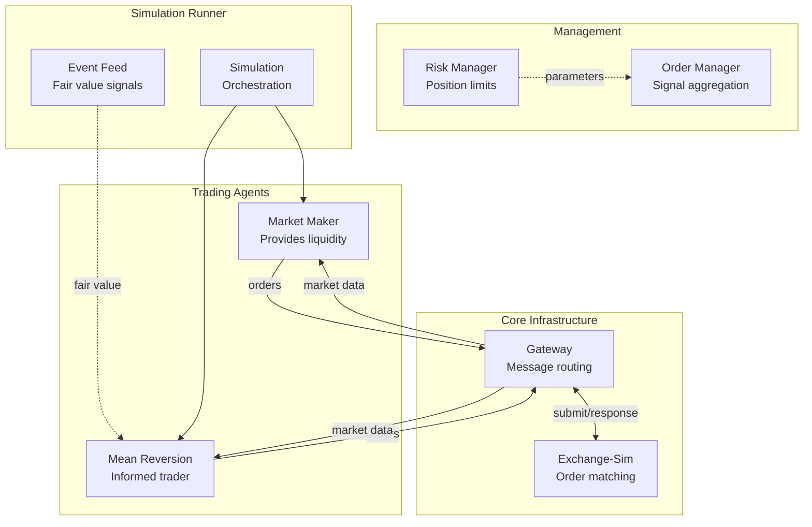
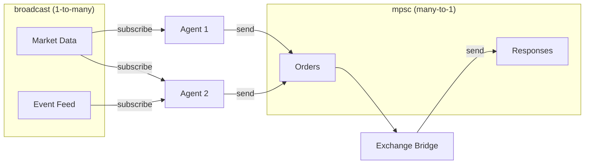

# Athena

A high-performance multi-agent trading simulation platform built in Rust with Clean Architecture principles.

## Overview

Athena simulates realistic market conditions where multiple trading agents compete: market makers provide liquidity while informed traders exploit price deviations. The platform features a central limit order book with multiple matching algorithms, risk controls, and a configurable time system.

## Architecture



See [Architecture Documentation](docs/ARCHITECTURE.md) for detailed sequence diagrams and component interactions.

## Crate Structure

| Crate | Path | Description |
|-------|------|-------------|
| **athena-core** | `crates/shared/core` | Domain types: Order, Trade, Position, Fees, MarginAccount |
| **athena-ports** | `crates/shared/ports` | Trait definitions: MatchingEngine, RiskManager |
| **athena-matching** | `crates/shared/matching` | Matching engines: Price-Time Priority, Pro-Rata |
| **athena-clock** | `crates/shared/clock` | Time management: Real-time, Accelerated, Fixed |
| **athena-risk** | `crates/shared/risk` | Risk adapter: margin validation, liquidation |
| **athena-gateway** | `crates/gateway` | Transport layer: message routing, wire formats |
| **athena-strategy** | `crates/strategy` | Strategy framework: traits, order book, built-in strategies |
| **athena-order-manager** | `crates/order-manager` | Signal aggregation, execution planning, position tracking |
| **athena-risk-manager** | `crates/risk-manager` | Trading risk parameters, surveillance, drawdown limits |
| **athena-runner** | `crates/runner` | Simulation orchestration: agents, event feed, bootstrap |
| **exchange-sim** | `crates/exchange-sim` | Exchange simulation: order books, matching, routing |

## Features

### Trading Strategies

**Market Maker** - Provides liquidity with inventory-based quote skewing:
```rust
use athena_strategy::{BasicMarketMaker, MarketMakerConfig};
use rust_decimal_macros::dec;

let config = MarketMakerConfig {
    spread_bps: dec!(10),       // 10 bps spread
    quote_size: dec!(0.1),      // 0.1 BTC per side
    max_position: dec!(10),     // Max 10 BTC
    skew_factor: dec!(5),       // Skew 5 bps per inventory unit
    ..Default::default()
};
let strategy = BasicMarketMaker::new(config);
```

**Mean Reversion Taker** - Trades on fair value deviations:
```rust
use athena_strategy::{MeanReversionTaker, MeanReversionConfig};

let config = MeanReversionConfig {
    entry_threshold_bps: dec!(50),  // Enter at 0.5% deviation
    exit_threshold_bps: dec!(10),   // Exit at 0.1% deviation
    trade_size: dec!(0.1),
    max_position: dec!(1),
    ..Default::default()
};
let strategy = MeanReversionTaker::new(config);
```

### Order Types
- **Market Orders**: Execute immediately at best available price
- **Limit Orders**: Execute at specified price or better
- **Stop Loss/Limit Orders**: Trigger when stop price is reached

### Time-in-Force
- **IOC** (Immediate or Cancel)
- **FOK** (Fill or Kill)
- **GTC** (Good Till Canceled)
- **GTD** (Good Till Date)

### Matching Algorithms
- **Price-Time Priority (FIFO)**: Standard exchange matching
- **Pro-Rata**: Proportional allocation based on order size

### Risk Management
- Position limits per instrument
- Drawdown-based size reduction
- Market quality surveillance (spoofing, layering detection)
- Trading halt on limit breach

## Quick Start

### Prerequisites
- Rust 1.85+ (Edition 2024)

### Installation

```bash
git clone https://github.com/yourusername/athena.git
cd athena
cargo build --release
```

### Running a Simulation

```rust
use athena_runner::simulation::{SimulationConfig, TradingSimulation};
use std::time::Duration;

#[tokio::main]
async fn main() {
    let config = SimulationConfig {
        duration: Duration::from_secs(60),
        ..Default::default()
    };

    let sim = TradingSimulation::with_config(config)
        .await
        .expect("Failed to create simulation");

    let results = sim.run().await;

    println!("Orders: {}, Trades: {}",
        results.total_orders,
        results.total_trades);
}
```

See [Simulation Guide](docs/SIMULATION.md) for detailed usage.

### Running Tests

```bash
# Run all tests (181 tests across all crates)
cargo test --workspace

# Run tests for specific crate
cargo test -p athena-strategy
cargo test -p athena-runner

# Run with logging
RUST_LOG=debug cargo test --workspace -- --nocapture
```

## Channel Architecture

Components communicate via tokio channels with zero serialization overhead:



**Key Design Decisions:**
- **No serialization**: Channels pass Rust types directly
- **Agent isolation**: Each agent has private state (LocalOrderBook, Positions)
- **Lock-free**: Broadcast channels clone data, no shared mutable state

## Documentation

| Document | Description |
|----------|-------------|
| [Architecture](docs/ARCHITECTURE.md) | System design, component interactions, sequence diagrams |
| [Simulation Guide](docs/SIMULATION.md) | Running multi-agent simulations, configuration reference |

## Test Coverage

| Crate | Tests | Description |
|-------|-------|-------------|
| athena-core | 48 | Domain entities, fees, margin |
| athena-matching | 10 | Price-time, pro-rata matching |
| athena-clock | 8 | Time scales, drift |
| athena-risk | 10 | Margin validation, liquidation |
| athena-gateway | 12 | Transport, messages |
| athena-strategy | 16 | Order book, strategies |
| athena-order-manager | 38 | Signals, execution, risk |
| athena-risk-manager | 16 | Parameters, surveillance |
| athena-runner | 16 | Agents, simulation |
| exchange-sim | 14 | Integration tests |

**Total: 181 tests passing**

## Performance Considerations

- **BTreeMap** for price levels with vectors for time priority
- **Tokio channels** for lock-free inter-component communication
- **rust_decimal** for precise financial calculations
- **Per-agent LocalOrderBook** eliminates contention

For ultra-low-latency:
- Lock-free data structures
- SIMD optimizations for matching
- Memory pooling for order allocation
- Custom allocators

## License

MIT License - see LICENSE file for details.
