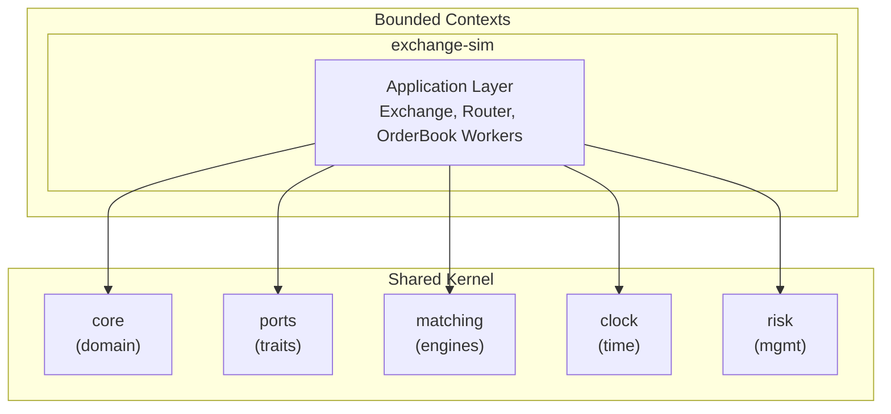
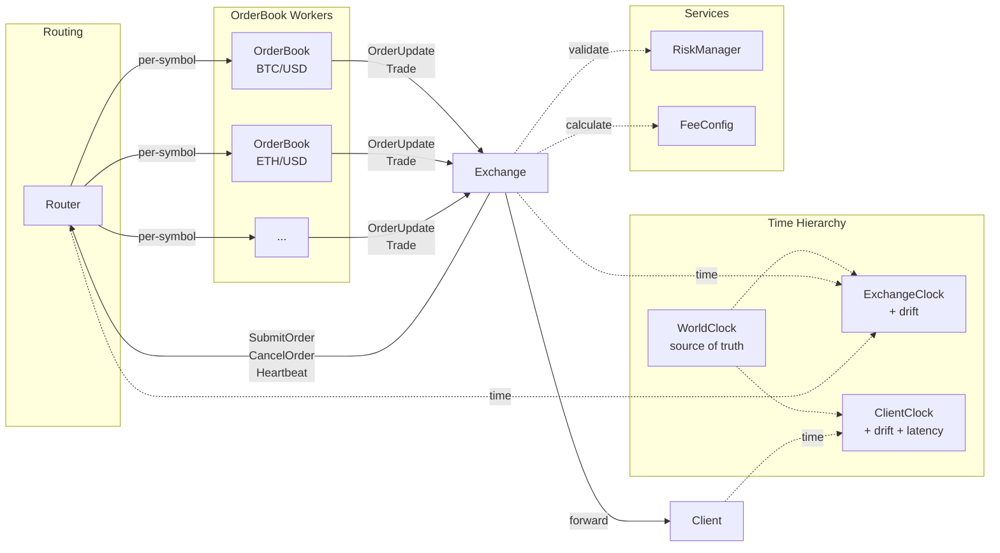

# Athena

A high-performance market simulator for training market making and taking strategies, built in Rust with Clean Architecture principles.

## Overview

Athena is designed to simulate realistic market conditions for developing and backtesting trading strategies. It features a central limit order book with multiple matching algorithms, fee management, risk controls, and a configurable time system for testing.

## Architecture

Athena follows **Clean Architecture** with a **Shared Kernel** pattern, organized as a Cargo workspace monorepo:



### Crate Structure

| Crate | Path | Description |
|-------|------|-------------|
| **athena-core** | `crates/shared/core` | Pure domain types (Order, Trade, Position, Fees, MarginAccount). No async, no I/O. |
| **athena-ports** | `crates/shared/ports` | Trait definitions (MatchingEngine, RiskManager). Hexagonal architecture ports. |
| **athena-matching** | `crates/shared/matching` | Matching engine implementations (Price-Time Priority, Pro-Rata). |
| **athena-clock** | `crates/shared/clock` | Time management with configurable scales (Real-time, Accelerated, Fixed). |
| **athena-risk** | `crates/shared/risk` | Risk management adapter (margin validation, liquidation triggers). |
| **exchange-sim** | `crates/exchange-sim` | Main application orchestrating all components via async channels. |

### Why Shared Kernel?

The `shared/` crates contain domain logic used across multiple bounded contexts:

- **athena-core**: Domain entities shared everywhere (Order, Trade, Position, Fees)
- **athena-ports**: Interface contracts that multiple contexts implement
- **athena-risk**: Risk logic needed by both the exchange simulator and future production systems

This pattern allows different bounded contexts (e.g., exchange-sim, backtester, live trading) to share the same domain model while maintaining independence at the application layer.

## Features

### Order Types
- **Market Orders**: Execute immediately at best available price
- **Limit Orders**: Execute at specified price or better
- **Stop Loss Orders**: Trigger market order when stop price is reached
- **Stop Limit Orders**: Trigger limit order when stop price is reached

### Time-in-Force
- **IOC** (Immediate or Cancel): Fill what's possible, cancel the rest
- **FOK** (Fill or Kill): Fill completely or cancel entirely
- **GTC** (Good Till Canceled): Remain active until filled or canceled
- **GTD** (Good Till Date): Active until specified expiration time
- **DAY**: Cancel at end of trading day

### Matching Algorithms
- **Price-Time Priority (FIFO)**: Standard price-time priority matching
- **Pro-Rata**: Proportional allocation based on order size (configurable minimum)

### Fee Management
```rust
// Configure fees per instrument
exchange.set_instrument_fees(
    InstrumentId::new("BTC/USD"),
    FeeSchedule::new(dec!(0.0001), dec!(0.0005))  // 0.01% maker, 0.05% taker
        .with_min_fee(dec!(0.01))
        .with_max_fee(dec!(100.0))
).await;

// Negative maker fees for rebates (market maker incentives)
FeeSchedule::new(dec!(-0.0001), dec!(0.001))  // -0.01% rebate for makers
```

**Fee Tiers**: Standard, VIP1, VIP2, VIP3, MarketMaker (with configurable multipliers)

### Risk Management
- **Position Tracking**: Long/short positions with PnL calculation
- **Margin Accounts**: Cross and isolated margin modes
- **Margin Validation**: Pre-trade checks for sufficient margin
- **Liquidation Triggers**: Automatic position closure when margin falls below maintenance level

```rust
// Register a margin account
let account = MarginAccount::new(owner_id, Decimal::new(10000, 0)); // $10,000 balance
let account_id = exchange.register_account(account).await;

// Validate order against risk limits before submission
exchange.validate_order_risk(&account_id, &order).await?;
```

### Time System
Configurable clock for testing and simulation:

```rust
// Real-time (1:1 with wall clock)
exchange.set_time_scale(TimeScale::Normal).await?;

// Accelerated (10x speed)
exchange.set_time_scale(TimeScale::Accelerated(10.0)).await?;

// Fixed time (manual control)
exchange.set_time_scale(TimeScale::Fixed).await?;
exchange.advance_time(Duration::hours(1)).await?;
```

## Async Channel Architecture

Components communicate via `tokio::sync::mpsc` channels:



- **Exchange → Router**: Order submission, cancellation, heartbeats
- **Router → OrderBook Workers**: Per-symbol message routing (one worker per instrument)
- **OrderBook Workers → Exchange**: Trade executions, order updates via `exchange_tx`
- **Exchange → Client**: Forwards notifications to external consumers
- **WorldClock**: Source of truth for simulation time (Normal, Accelerated, Fixed modes)
- **ExchangeClock**: Exchange's view of time (may have configurable drift from WorldClock)
- **ClientClock**: Client's view of time (drift + network latency simulation)
- **RiskManager**: Pre-trade margin validation and liquidation checks
- **FeeConfig**: Per-instrument fee schedules and tier multipliers

## Getting Started

### Prerequisites
- Rust 1.85+ (Edition 2024)
- Cargo

### Installation

```bash
git clone https://github.com/yourusername/athena.git
cd athena
cargo build --release
```

### Running Tests

```bash
# Run all tests (80 tests across all crates)
cargo test --workspace

# Run tests for specific crate
cargo test -p athena-core
cargo test -p athena-matching
cargo test -p exchange-sim
```

## Usage Examples

### Creating and Submitting Orders

```rust
use athena_core::{Order, Side, OrderType, TimeInForce, InstrumentId};
use rust_decimal_macros::dec;

// Create a limit buy order
let order = Order::new(
    InstrumentId::new("BTC/USD"),
    Side::Buy,
    OrderType::Limit,
    dec!(1.5),           // Quantity
    Some(dec!(50000)),   // Price
    None,                // Stop price
    TimeInForce::GTC,
);

// Submit to exchange
let order_id = exchange.submit_order(order).await?;
```

### Setting Up Fee Schedules

```rust
use athena_core::{FeeSchedule, FeeConfig, FeeTier, InstrumentId};
use rust_decimal_macros::dec;

// Create fee config with custom defaults
let mut fee_config = FeeConfig::with_default_fees(dec!(0.001), dec!(0.002));

// Set VIP tier discount (20% off)
fee_config.set_tier_multiplier(FeeTier::Vip1, dec!(0.8));

// Calculate fees
let fee = fee_config.calculate_fee(
    &InstrumentId::new("BTC/USD"),
    dec!(50000),  // notional value
    false,        // is_maker
    FeeTier::Vip1,
);
```

### Testing with Time Control

```rust
use athena_clock::TimeScale;
use chrono::Duration;

// Set fixed time for deterministic testing
exchange.set_time_scale(TimeScale::Fixed).await?;

// Submit GTD order expiring in 30 minutes
let gtd_order = Order::new(
    InstrumentId::new("BTC/USD"),
    Side::Buy,
    OrderType::Limit,
    dec!(1.0),
    Some(dec!(50000)),
    None,
    TimeInForce::GTD(Utc::now() + Duration::minutes(30)),
);
exchange.submit_order(gtd_order).await?;

// Fast forward 1 hour to trigger expiration
exchange.advance_time(Duration::hours(1)).await?;
```

### Configuring Matching Algorithms

```rust
// Use Price-Time Priority (default)
exchange.set_matching_algorithm("BTC/USD".to_string(), "price-time".to_string())?;

// Use Pro-Rata for specific instruments (e.g., futures)
exchange.set_matching_algorithm("ES-FUT".to_string(), "pro-rata".to_string())?;
```

## Performance Considerations

- **BTreeMap** for price levels with vectors for time priority within each level
- **DashMap** for concurrent access to order book state
- **Tokio channels** for lock-free inter-component communication
- **Decimal precision** via `rust_decimal` for accurate financial calculations

For ultra-low-latency requirements, consider:
- Lock-free data structures
- SIMD optimizations for matching
- Memory pooling for order allocation
- Custom allocators

## Test Coverage

| Crate | Tests |
|-------|-------|
| athena-core | Domain entity tests, fee calculations |
| athena-matching | Price-Time, Pro-Rata algorithm tests |
| athena-clock | Time scale tests |
| athena-risk | Margin validation, liquidation tests |
| exchange-sim | Integration tests |

**Total: 80 tests passing**

## License

This project is licensed under the MIT License - see the LICENSE file for details.
