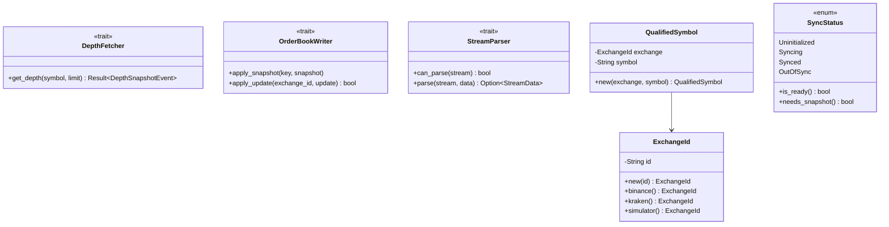

# Gateway In Module

A **Clean Architecture** gateway module for connecting to cryptocurrency exchanges. Handles WebSocket streaming, REST API calls, and order book synchronization with full SOLID compliance.

## Table of Contents

- [Architecture Overview](#architecture-overview)
- [Module Structure](#module-structure)
- [Layer Details](#layer-details)
- [Order Book Synchronization](#order-book-synchronization)
- [Multi-Exchange Support](#multi-exchange-support)
- [SOLID Principles](#solid-principles)
- [Configuration](#configuration)
- [Usage Examples](#usage-examples)

---

## Architecture Overview

The module follows **Clean Architecture** with clear separation of concerns:


### Dependency Flow


**Key Principle**: Application layer depends on domain abstractions. Infrastructure implements those abstractions.

---

## Module Structure

```
agent/src/gateway_in/
├── mod.rs                          # Module root with re-exports
│
├── config/                         # Configuration Layer
│   ├── mod.rs                      # Config exports
│   ├── types.rs                    # JSON config structures
│   ├── loader.rs                   # Config loading & validation
│   └── gateway_config.json         # Default configuration
│
├── domain/                         # Domain Layer (Core)
│   ├── mod.rs                      # Domain exports
│   ├── traits.rs                   # Abstraction boundaries
│   ├── events.rs                   # Domain events & WS protocol
│   ├── exchange.rs                 # ExchangeId, QualifiedSymbol
│   └── sync_status.rs              # Sync state machine
│
├── application/                    # Application Layer
│   ├── mod.rs                      # Application exports
│   ├── config.rs                   # App-level config objects
│   ├── market_data_handler.rs      # Per-exchange orchestration
│   └── exchange_manager.rs         # Multi-exchange orchestration
│
└── infrastructure/                 # Infrastructure Layer
    ├── mod.rs                      # Infrastructure exports
    ├── rest_client.rs              # HTTP REST client
    ├── ws_client.rs                # WebSocket client
    └── parsers.rs                  # Exchange format parsers
```

---

## Layer Details

### Config Layer

Handles JSON-based configuration with serde deserialization.


### Domain Layer

Contains business abstractions with **zero external dependencies**.



### Application Layer

Orchestrates domain logic using infrastructure components.


### Infrastructure Layer

Implements domain abstractions with concrete technology.


---

## Order Book Synchronization

### Sync State Machine


### Synchronization Flow


### Buffer Replay Algorithm


---

## Multi-Exchange Support

### Architecture


### Qualified Symbol Keys


---

## SOLID Principles

### Single Responsibility (SRP)


### Open/Closed Principle (OCP)


### Liskov Substitution (LSP)

```rust
// All DepthFetcher implementations are interchangeable
pub struct MarketDataHandler<F: DepthFetcher, B: OrderBookWriter> {
    fetcher: Arc<F>,       // RestClient, MockFetcher, etc.
    order_books: Arc<B>,   // OrderBookManager, TestBooks, etc.
}

// Works with ANY implementation
let handler = MarketDataHandler::new(config, RestClient::new(...), books);
let handler = MarketDataHandler::new(config, MockFetcher::new(...), books);
```

### Interface Segregation (ISP)


### Dependency Inversion (DIP)


---

## Configuration

### Default Configuration

```json
{
  "exchanges": [
    {
      "id": "binance",
      "name": "Binance",
      "enabled": true,
      "rest_url": "https://api.binance.com",
      "ws_url": "wss://stream.binance.com:9443/ws",
      "symbols": ["BTCUSDT", "ETHUSDT"],
      "market_data": {
        "snapshot_interval_ms": 100,
        "max_buffer_size": 1000
      }
    },
    {
      "id": "simulator",
      "name": "Local Simulator",
      "enabled": true,
      "rest_url": "http://localhost:8080",
      "ws_url": "ws://localhost:8080/ws",
      "symbols": ["BTCUSDT", "ETHUSDT"]
    }
  ],
  "global": {
    "reconnect_delay_ms": 5000,
    "max_reconnect_attempts": 10,
    "heartbeat_interval_ms": 30000
  }
}
```

### Configuration Options

| Option | Default | Description |
|--------|---------|-------------|
| `snapshot_interval_ms` | 100 | Minimum time between REST snapshot requests |
| `max_buffer_size` | 1000 | Maximum updates to buffer while syncing |
| `reconnect_delay_ms` | 5000 | Delay before reconnection attempts |
| `max_reconnect_attempts` | 10 | Maximum reconnection attempts |
| `heartbeat_interval_ms` | 30000 | WebSocket heartbeat interval |

---

## Usage Examples

### Basic Setup

```rust
use agent::gateway_in::{
    load_default_config, ExchangeManager, ExchangeId
};
use agent::order_book::OrderBookManager;

#[tokio::main]
async fn main() {
    // Load configuration
    let config = load_default_config().unwrap();

    // Create shared order book manager
    let order_books = OrderBookManager::new();

    // Create and initialize exchange manager
    let mut manager = ExchangeManager::new(config, order_books.clone());
    manager.initialize();

    // Start all exchanges
    let event_senders = manager.start_all().await;

    // Access order books
    let btc_book = order_books.book("binance", "BTCUSDT");

    if btc_book.is_initialized() {
        println!("Best bid: {:?}", btc_book.best_bid());
        println!("Best ask: {:?}", btc_book.best_ask());
    }
}
```

### Single Exchange with Gateway Facade

```rust
use agent::gateway_in::{Gateway, GatewayConfig};

#[tokio::main]
async fn main() {
    let config = GatewayConfig::new(
        "http://localhost:8080".to_string(),
        "ws://localhost:8080/ws".to_string(),
        "api-key".to_string(),
    );

    let gateway = Gateway::new(config);

    // Use REST client
    let depth = gateway.rest()
        .get_depth("BTCUSDT", Some(20))
        .await
        .unwrap();

    println!("Last update ID: {}", depth.last_update_id);
}
```

### Custom Parser Implementation

```rust
use agent::gateway_in::{StreamParser, StreamData};
use serde_json::Value;

struct CoinbaseParser;

impl StreamParser for CoinbaseParser {
    fn can_parse(&self, stream: &str) -> bool {
        stream.contains("coinbase")
    }

    fn parse(&self, stream: &str, data: &Value) -> Option<StreamData> {
        // Parse Coinbase-specific format
        let symbol = data.get("product_id")?.as_str()?;
        let bids = parse_coinbase_levels(data.get("bids")?);
        let asks = parse_coinbase_levels(data.get("asks")?);

        Some(StreamData::DepthUpdate {
            symbol: symbol.to_string(),
            event_time: 0,
            first_update_id: 0,
            final_update_id: 0,
            bids,
            asks,
        })
    }
}
```

### Accessing Multi-Exchange Data

```rust
use agent::gateway_in::ExchangeId;

// Get books for same symbol on different exchanges
let binance_btc = order_books.book("binance", "BTCUSDT");
let kraken_btc = order_books.book("kraken", "BTCUSDT");

// Arbitrage detection
if let (Some(binance_ask), Some(kraken_bid)) =
    (binance_btc.best_ask(), kraken_btc.best_bid())
{
    if kraken_bid.price > binance_ask.price {
        let spread = kraken_bid.price.inner() - binance_ask.price.inner();
        println!("Arbitrage opportunity: {} spread", spread);
    }
}

// List all symbols for an exchange
let binance_symbols = order_books.symbols_for_exchange(&ExchangeId::binance());
println!("Binance symbols: {:?}", binance_symbols);
```

---

## Error Handling

### Error Types

```rust
pub enum RestError {
    Http(reqwest::Error),           // Network/HTTP errors
    Api { code: i32, msg: String }, // Exchange API errors
    Parse(String),                  // JSON parsing errors
}

pub enum WsError {
    Connection(tungstenite::Error), // WebSocket connection errors
    Serialization(serde_json::Error), // Message serialization errors
    ChannelClosed,                  // Internal channel closed
    NotConnected,                   // Not connected to exchange
}

pub enum ConfigError {
    IoError(std::io::Error),        // File I/O errors
    ParseError(serde_json::Error),  // JSON parsing errors
    NoEnabledExchanges,             // No exchanges enabled
    ExchangeNotFound(String),       // Exchange not in config
}
```

### Recovery Strategies

| Error | Recovery |
|-------|----------|
| Snapshot fetch failure | Requeued with interval backoff |
| Update apply failure | Mark OutOfSync, requeue snapshot |
| WebSocket disconnect | Mark all symbols OutOfSync, reconnect |
| Buffer overflow | Drop oldest updates, continue syncing |

---

## Thread Safety


---

## Testing

```rust
// Mock implementations for testing
struct MockFetcher {
    responses: HashMap<String, DepthSnapshotEvent>,
}

impl DepthFetcher for MockFetcher {
    async fn get_depth(&self, symbol: &str, _limit: Option<u32>)
        -> Result<DepthSnapshotEvent, RestError>
    {
        self.responses.get(symbol)
            .cloned()
            .ok_or(RestError::Api { code: -1, msg: "Not found".into() })
    }
}

#[test]
fn test_sync_flow() {
    let fetcher = MockFetcher::with_response("BTCUSDT", snapshot);
    let books = TestOrderBooks::new();

    let handler = MarketDataHandler::new(config, fetcher, books);
    // Test synchronization logic...
}
```

---

## License

See [LICENSE](../../../LICENSE) for details.
