# Athena Architecture

This document describes the system architecture, component interactions, and data flow through Athena's trading simulation platform.

## System Overview

Athena is a multi-agent trading simulation platform where independent trading agents compete in a realistic market environment. The architecture follows Clean Architecture principles with clear separation between:

- **Domain Layer**: Core trading types (Order, Trade, Position)
- **Application Layer**: Strategy execution, order management, risk controls
- **Infrastructure Layer**: Exchange simulation, channel-based communication

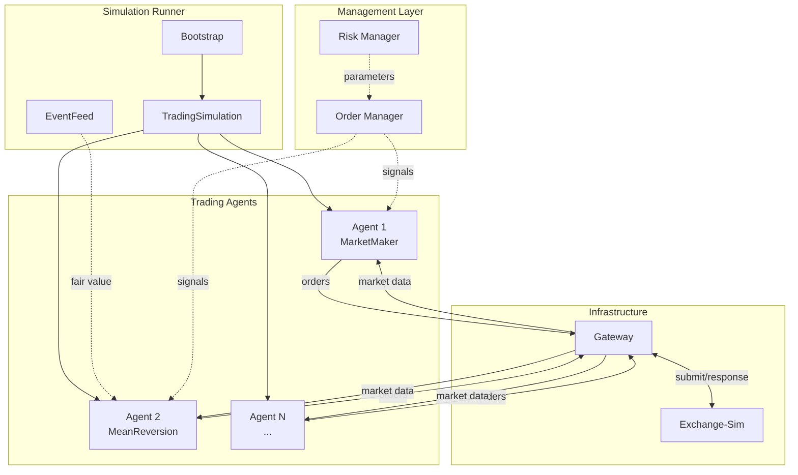

## Component Details

### 1. Gateway (`athena-gateway`)

The Gateway provides a transport-agnostic interface between strategies and exchanges. It normalizes wire formats and handles message routing.

**Key Components:**
- `GatewayIn`: Receives exchange events, publishes to internal components
- `GatewayOut`: Receives order requests, submits to exchange
- `Transport`: Pluggable transport layer (channels, future: NATS, ZeroMQ)

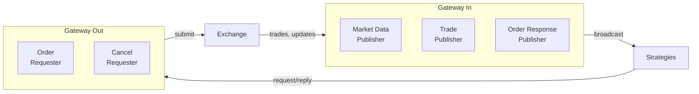

### 2. Strategy (`athena-strategy`)

Strategies implement trading logic and react to market events. Each strategy maintains its own local state (order book replica, positions) to avoid contention.

**Key Components:**
- `Strategy` trait: Interface for all trading strategies
- `LocalOrderBook`: Lock-free order book replica per strategy
- `StrategyContext`: Provides market state to strategy callbacks

**Built-in Strategies:**
- `BasicMarketMaker`: Inventory-based market making with quote skewing
- `MeanReversionTaker`: Informed trading based on fair value signals

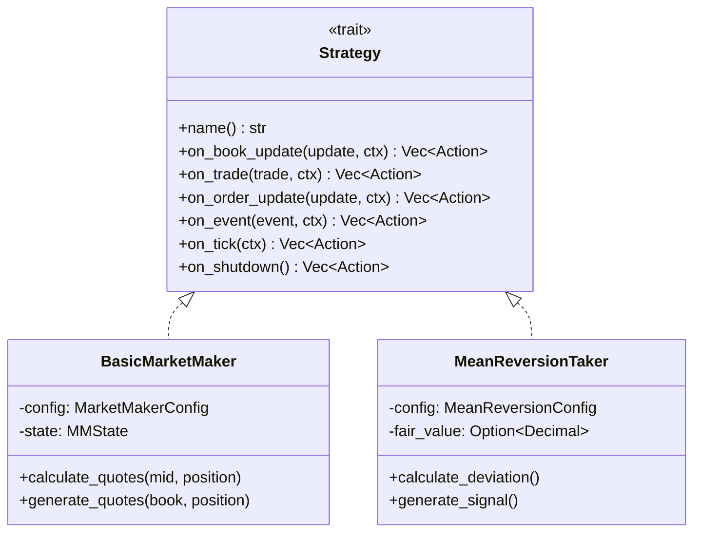

### 3. Order Manager (`athena-order-manager`)

Aggregates signals from multiple strategies into portfolio targets, plans execution, and validates against risk parameters.

**Key Components:**
- `SignalAggregator`: Combines signals by confidence weighting
- `ExecutionPlanner`: Converts portfolio delta to order slices
- `RiskValidator`: Validates targets against risk parameters
- `PositionTracker`: Tracks positions with strategy attribution

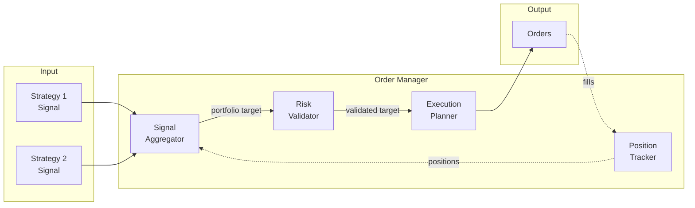

### 4. Risk Manager (`athena-risk-manager`)

Monitors trading activity and publishes risk parameters that control order execution.

**Key Components:**
- `TradingRiskManager`: Central risk state management
- `TradingRiskParameters`: Published limits and controls
- `BasicSurveillance`: Market manipulation detection

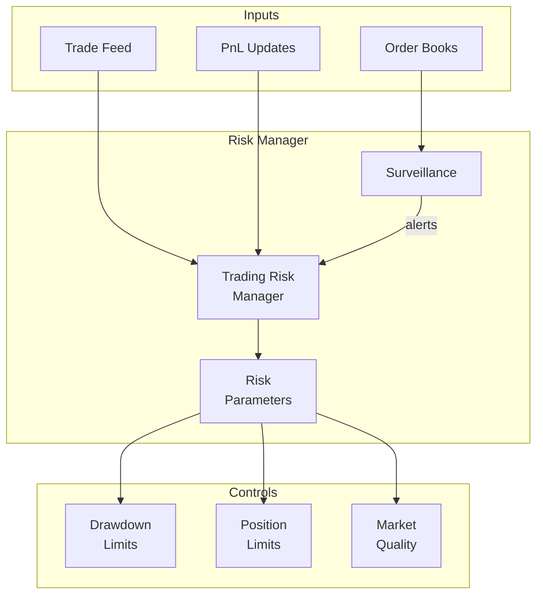

### 5. Runner (`athena-runner`)

Orchestrates the full simulation: bootstraps agents, connects channels, and manages the simulation lifecycle.

**Key Components:**
- `SimulationBootstrap`: Creates exchange, registers agent accounts
- `AgentRunner`: Wraps strategy with event loop and state
- `EventFeedSimulator`: Generates fair value and sentiment events
- `TradingSimulation`: Main orchestration loop

## Message Flow Sequences

### Order Submission Flow

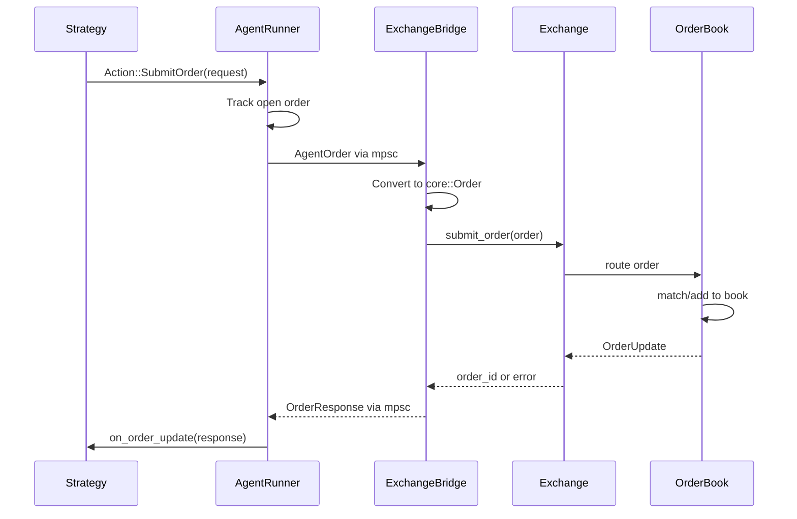

### Market Data Flow

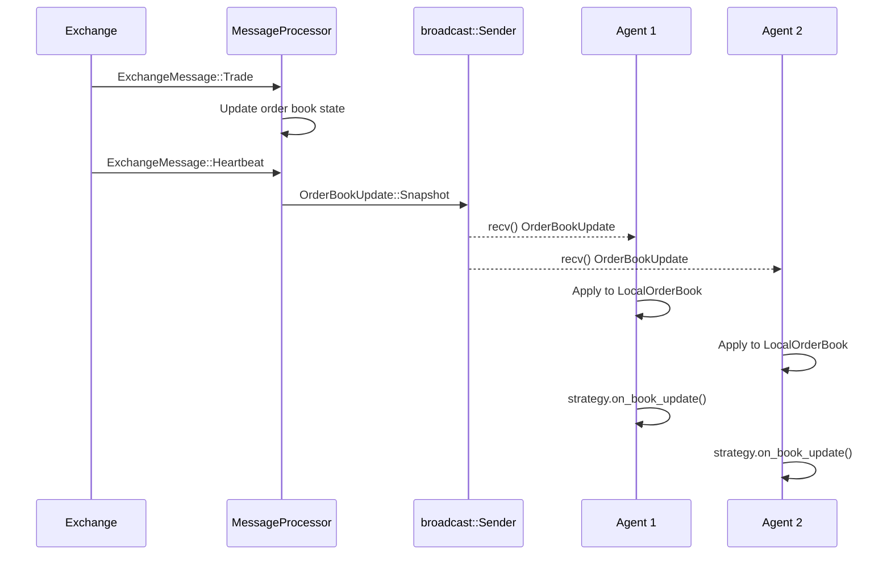

### Event Feed Flow (Informed Trading)

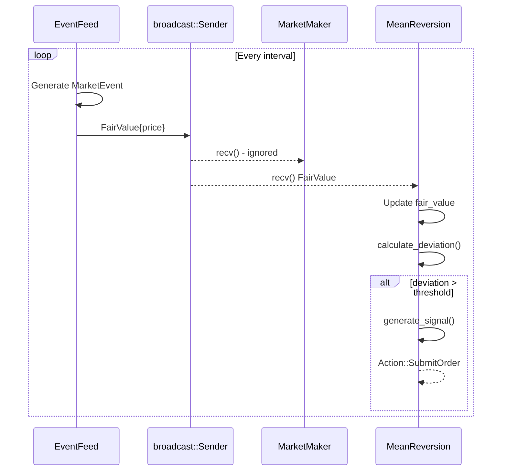

### Risk Validation Flow

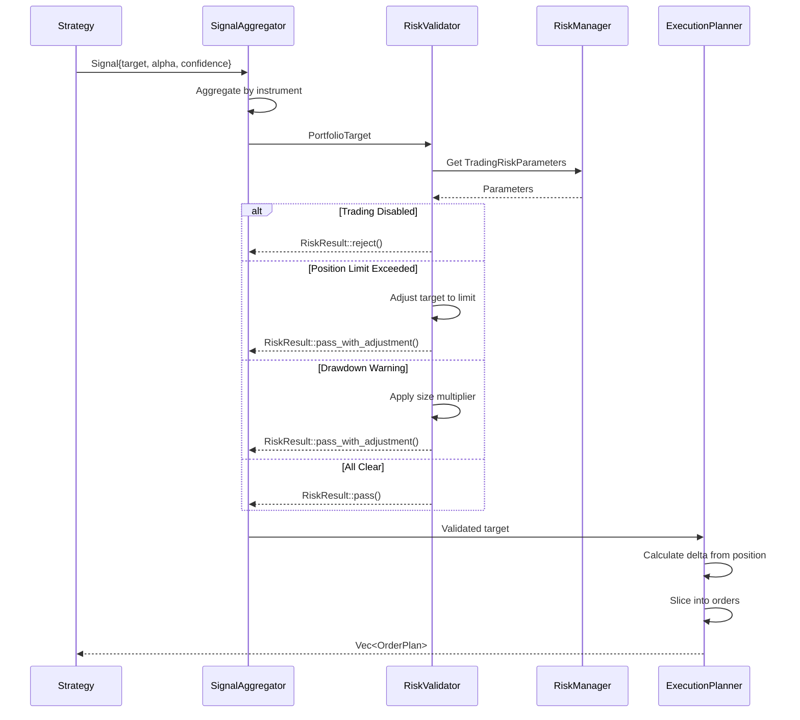

## Channel Architecture

All inter-component communication uses tokio channels - no serialization overhead for in-process messaging.

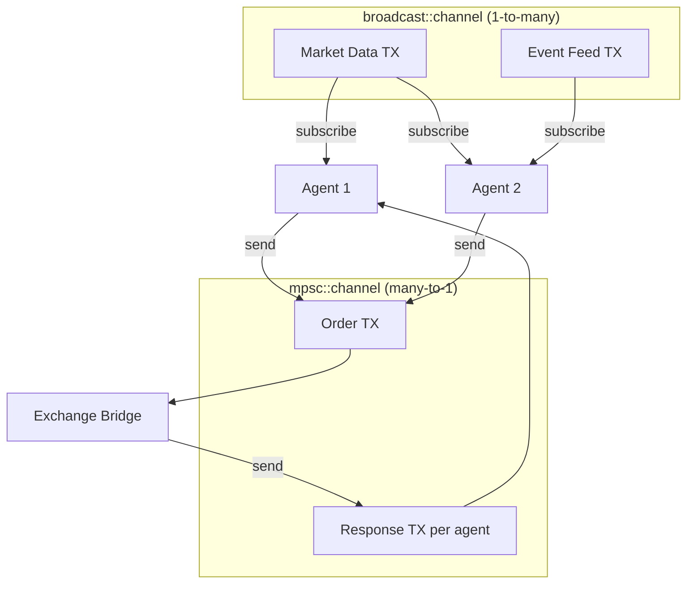

**Channel Types:**
| Channel | Type | Purpose |
|---------|------|---------|
| Market Data | `broadcast<OrderBookUpdate>` | OB snapshots/deltas to all agents |
| Event Feed | `broadcast<MarketEvent>` | Fair value, sentiment to takers |
| Orders | `mpsc<AgentOrder>` | Order requests from agents |
| Responses | `mpsc<OrderResponse>` | Per-agent order responses |

## Agent Isolation

Each agent runs in complete isolation with private state:

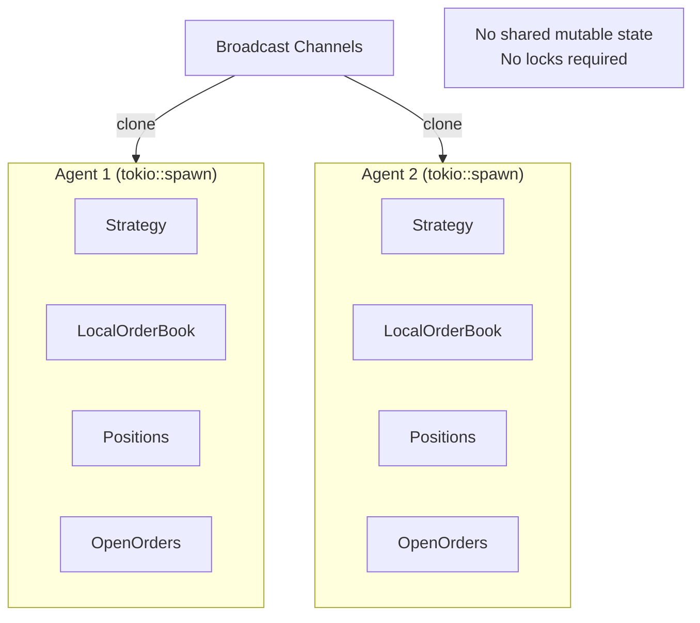

**Benefits:**
- No contention between agents
- Each agent processes at its own pace
- Lagged agents don't block others
- Easy to add/remove agents dynamically

## See Also

- [Simulation Guide](SIMULATION.md) - Running multi-agent simulations
- [README](../README.md) - Project overview and quick start
