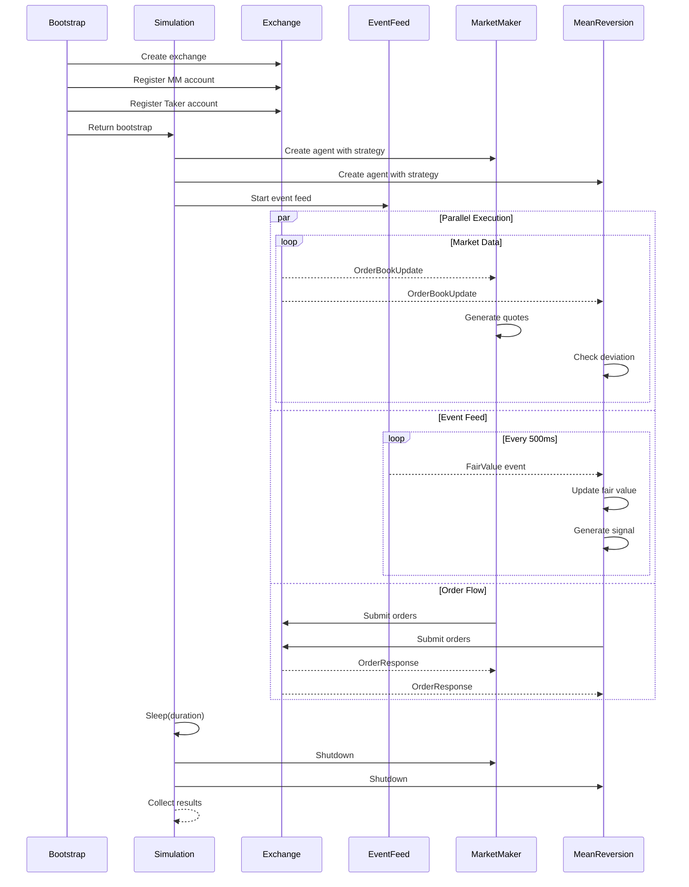

# Multi-Agent Trading Simulation

This guide covers running multi-agent trading simulations with Athena's runner crate.

## Overview

The simulation framework enables multiple trading agents to compete in a realistic market environment:

- **Market Makers**: Provide liquidity by quoting bid/ask prices
- **Informed Traders**: Trade on fair value signals from the event feed
- **Arbitrageurs**: Exploit price discrepancies (future)

Each agent runs in isolation with its own:
- Local order book replica
- Position tracking
- Open order state
- Strategy instance

## Quick Start

```rust
use athena_runner::simulation::{SimulationConfig, TradingSimulation};
use std::time::Duration;

#[tokio::main]
async fn main() {
    // Create simulation with default config
    let config = SimulationConfig {
        duration: Duration::from_secs(60),
        event_interval_ms: 500,
        ..Default::default()
    };

    let sim = TradingSimulation::with_config(config)
        .await
        .expect("Failed to create simulation");

    // Run and collect results
    let results = sim.run().await;

    println!("Simulation complete!");
    println!("  Total orders: {}", results.total_orders);
    println!("  Total trades: {}", results.total_trades);
}
```

## Components

### SimulationBootstrap

Creates the exchange and registers agent accounts before the simulation starts.

```rust
use athena_runner::bootstrap::{BootstrapConfig, SimulationBootstrap, AgentType};

let config = BootstrapConfig {
    instruments: vec!["BTC-USD".to_string()],
    exchange_heartbeat_ms: 50,
    matching_algorithm: "price-time".to_string(),
};

let bootstrap = SimulationBootstrap::with_config(config).await?;

// Access created resources
let exchange = bootstrap.exchange;
let agents = bootstrap.agents;  // Vec<AgentAccount>

for agent in &agents {
    println!("Agent: {} ({:?})", agent.agent_id, agent.agent_type);
    println!("  Account ID: {:?}", agent.account_id);
    println!("  Instruments: {:?}", agent.instruments);
}
```

### AgentRunner

Wraps a strategy with an event loop that handles:
- Market data updates
- Event feed updates (for informed traders)
- Order responses
- Strategy lifecycle

```rust
use athena_runner::agent::{AgentConfig, AgentRunner};
use athena_strategy::{BasicMarketMaker, MarketMakerConfig};

let agent_config = AgentConfig {
    agent_id: "mm-agent".to_string(),
    account_id: account_uuid,
    instruments: vec!["BTC-USD".to_string()],
    uses_event_feed: false,  // Market makers don't need fair value
};

let strategy = BasicMarketMaker::new(MarketMakerConfig::default());

let agent = AgentRunner::new(
    agent_config,
    strategy,
    md_rx,           // broadcast::Receiver<OrderBookUpdate>
    None,            // No event feed for market makers
    order_tx,        // mpsc::Sender<AgentOrder>
    response_rx,     // mpsc::Receiver<OrderResponse>
);

// Run in background
tokio::spawn(agent.run());
```

### EventFeedSimulator

Generates market events that informed traders can use:

```rust
use athena_runner::event_feed::{EventFeedConfig, EventFeedSimulator};
use rust_decimal_macros::dec;

let mut config = EventFeedConfig::default();
config.initial_fair_values.insert("BTC-USD".to_string(), dec!(50000));
config.volatility = dec!(0.001);           // 0.1% per step
config.sentiment_probability = 0.1;         // 10% chance of sentiment event

let mut feed = EventFeedSimulator::new(config);

// Subscribe to events
let rx = feed.subscribe();

// Run the feed (generates events every interval_ms)
tokio::spawn(async move {
    feed.run(500).await;  // 500ms interval
});

// Receive events
while let Ok(event) = rx.recv().await {
    match event {
        MarketEvent::FairValue { instrument_id, price } => {
            println!("Fair value update: {} = {}", instrument_id, price);
        }
        MarketEvent::Sentiment { instrument_id, score } => {
            println!("Sentiment: {} = {}", instrument_id, score);
        }
        _ => {}
    }
}
```

## Agent Types

### Market Maker Agent

Provides liquidity by continuously quoting bid and ask prices.

**Behavior:**
1. Receives order book updates
2. Calculates mid price
3. Quotes bid/ask with configurable spread
4. Skews quotes based on inventory (reduces position when too long/short)
5. Respects position limits

```rust
use athena_strategy::{BasicMarketMaker, MarketMakerConfig};
use rust_decimal_macros::dec;

let config = MarketMakerConfig {
    instrument_id: "BTC-USD".to_string(),
    spread_bps: dec!(10),       // 10 bps = 0.1% spread
    quote_size: dec!(0.1),      // Quote 0.1 BTC per side
    max_position: dec!(10),     // Max 10 BTC position
    skew_factor: dec!(5),       // Skew 5 bps per unit of inventory
    tick_size: dec!(0.01),      // Price tick size
    requote_threshold: dec!(5), // Requote if mid moves 5 ticks
};

let strategy = BasicMarketMaker::new(config);
```

### Mean Reversion Taker Agent

An informed trader that trades when market price deviates from fair value.

**Behavior:**
1. Receives fair value from event feed
2. Receives order book updates
3. Calculates deviation: `(mid - fair) / fair`
4. Enters position when deviation exceeds threshold
5. Exits when price reverts to fair value

```rust
use athena_strategy::{MeanReversionTaker, MeanReversionConfig};
use rust_decimal_macros::dec;

let config = MeanReversionConfig {
    instrument_id: "BTC-USD".to_string(),
    entry_threshold_bps: dec!(50),  // Enter when 0.5% from fair value
    exit_threshold_bps: dec!(10),   // Exit when within 0.1% of fair
    trade_size: dec!(0.1),          // Trade 0.1 BTC per signal
    max_position: dec!(1),          // Max 1 BTC position
};

let strategy = MeanReversionTaker::new(config);
```

## Simulation Flow



## Configuration Reference

### SimulationConfig

| Field | Type | Default | Description |
|-------|------|---------|-------------|
| `bootstrap` | `BootstrapConfig` | default | Exchange and agent setup |
| `event_feed` | `EventFeedConfig` | default | Fair value generation |
| `event_interval_ms` | `u64` | 500 | Event generation interval |
| `duration` | `Duration` | 10s | Total simulation duration |

### BootstrapConfig

| Field | Type | Default | Description |
|-------|------|---------|-------------|
| `instruments` | `Vec<String>` | ["BTC-USD"] | Tradeable instruments |
| `exchange_heartbeat_ms` | `u64` | 50 | Exchange heartbeat interval |
| `channel_capacity` | `usize` | 100 | Channel buffer size |
| `matching_algorithm` | `String` | "price-time" | Matching algorithm |

### EventFeedConfig

| Field | Type | Default | Description |
|-------|------|---------|-------------|
| `initial_fair_values` | `HashMap` | BTC=50000 | Starting fair values |
| `volatility` | `Decimal` | 0.001 | Per-step volatility |
| `mean_reversion` | `Decimal` | 0.1 | Mean reversion strength |
| `sentiment_probability` | `Decimal` | 0.1 | Chance of sentiment event |

## Results

After simulation completes, `SimulationResults` contains:

```rust
pub struct SimulationResults {
    pub total_trades: u64,
    pub trades_by_agent: HashMap<String, u64>,
    pub positions_by_agent: HashMap<String, HashMap<String, Decimal>>,
    pub pnl_by_agent: HashMap<String, Decimal>,
    pub total_orders: u64,
    pub orders_by_agent: HashMap<String, u64>,
    pub success: bool,
    pub error: Option<String>,
}
```

## Advanced Usage

### Custom Strategies

Implement the `Strategy` trait:

```rust
use athena_strategy::{Strategy, StrategyContext, Action};
use athena_gateway::messages::market_data::OrderBookUpdate;
use async_trait::async_trait;

pub struct MyStrategy {
    // Your state here
}

#[async_trait]
impl Strategy for MyStrategy {
    fn name(&self) -> &str {
        "MyStrategy"
    }

    async fn on_book_update(
        &mut self,
        update: &OrderBookUpdate,
        ctx: &StrategyContext<'_>,
    ) -> Vec<Action> {
        // Your logic here
        Vec::new()
    }

    // Override other methods as needed...
}
```

### Multiple Instruments

```rust
let config = BootstrapConfig {
    instruments: vec![
        "BTC-USD".to_string(),
        "ETH-USD".to_string(),
        "SOL-USD".to_string(),
    ],
    ..Default::default()
};
```

### Custom Matching Algorithms

```rust
// Price-Time Priority (default, FIFO)
matching_algorithm: "price-time".to_string(),

// Pro-Rata (proportional allocation)
matching_algorithm: "pro-rata".to_string(),
```

## See Also

- [Architecture](ARCHITECTURE.md) - System design and data flow
- [README](../README.md) - Project overview
