# Exchange Simulator

A **Binance-compatible exchange simulator** built with Clean Architecture principles. Provides a full-featured trading exchange with order matching, WebSocket streaming, and event-driven architecture.

## Table of Contents

- [Architecture Overview](#architecture-overview)
- [Module Structure](#module-structure)
- [Domain Layer](#domain-layer)
- [Application Layer](#application-layer)
- [Infrastructure Layer](#infrastructure-layer)
- [Presentation Layer](#presentation-layer)
- [Order Matching](#order-matching)
- [Key Flows](#key-flows)
- [API Reference](#api-reference)
- [Configuration](#configuration)

---

## Architecture Overview

The crate follows **Clean Architecture** with four distinct layers:

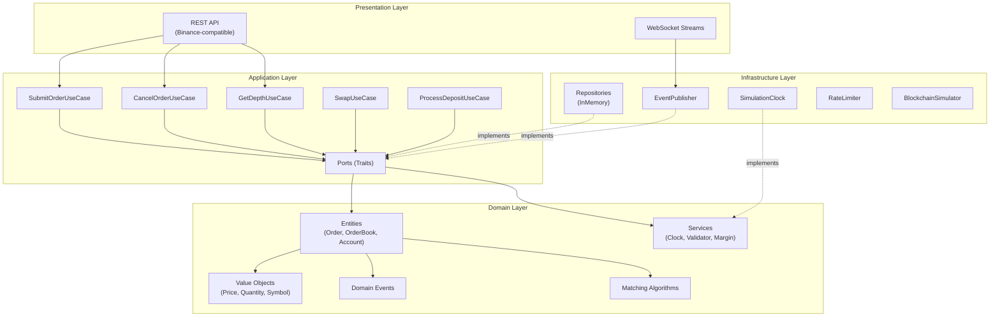

### Dependency Flow

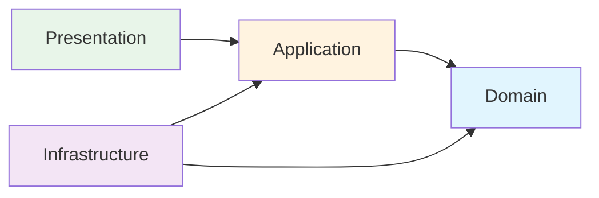

**Key Principle**: Domain has zero dependencies. Infrastructure implements domain-defined abstractions.

---

## Module Structure

```
exchange-sim/
├── src/
│   ├── lib.rs                    # Library entry point
│   ├── main.rs                   # Binary entry point
│   │
│   ├── domain/                   # Core business logic (no dependencies)
│   │   ├── entities/             # Order, OrderBook, Account, LiquidityPool
│   │   ├── value_objects/        # Price, Quantity, Symbol, Side, OrderType
│   │   ├── events/               # ExchangeEvent, DepthUpdate, TradeExecuted
│   │   ├── matching/             # MatchingAlgorithm trait
│   │   ├── instruments/          # Spot, Futures, Options, Perpetual
│   │   └── services/             # Clock, Validators, MarginCalculator
│   │
│   ├── application/              # Use cases & orchestration
│   │   ├── use_cases/            # SubmitOrder, CancelOrder, Swap, etc.
│   │   └── ports/                # Repository traits (interfaces)
│   │
│   ├── infrastructure/           # Implementations
│   │   ├── repositories/         # InMemory implementations
│   │   ├── clock/                # SimulationClock
│   │   ├── event_publisher/      # BroadcastEventPublisher
│   │   ├── rate_limiter/         # TokenBucketRateLimiter
│   │   ├── order_book_shard/     # Sharding support
│   │   └── blockchain_adapter/   # Blockchain simulation
│   │
│   └── presentation/             # API handlers
│       ├── rest/                 # REST API (Binance-compatible)
│       └── websocket/            # WebSocket streams
│
└── tests/                        # Integration tests
```

---

## Domain Layer

The domain layer contains all business logic with **zero external dependencies**.

### Entities

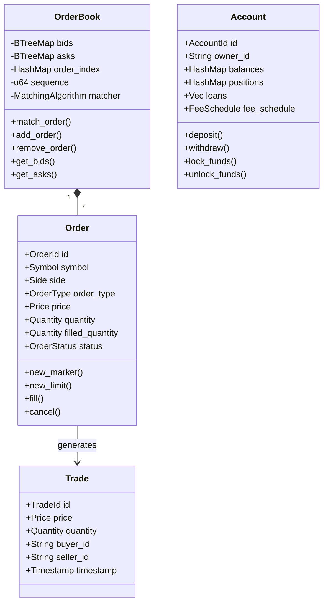

### Value Objects

| Type | Purpose | Example |
|------|---------|---------|
| `Symbol` | Trading pair identifier | `BTCUSDT` |
| `Price` | Decimal precision price | `45000.50` |
| `Quantity` | Order/trade quantity | `1.5` |
| `Side` | Buy or Sell | `Side::Buy` |
| `OrderType` | Market, Limit, Stop, etc. | `OrderType::Limit` |
| `TimeInForce` | GTC, IOC, FOK, GTX | `TimeInForce::Gtc` |

### Domain Events

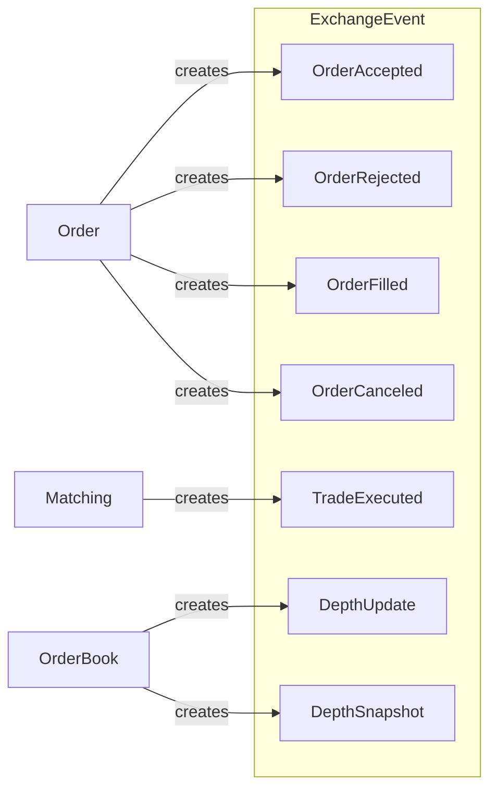

### Matching Algorithms

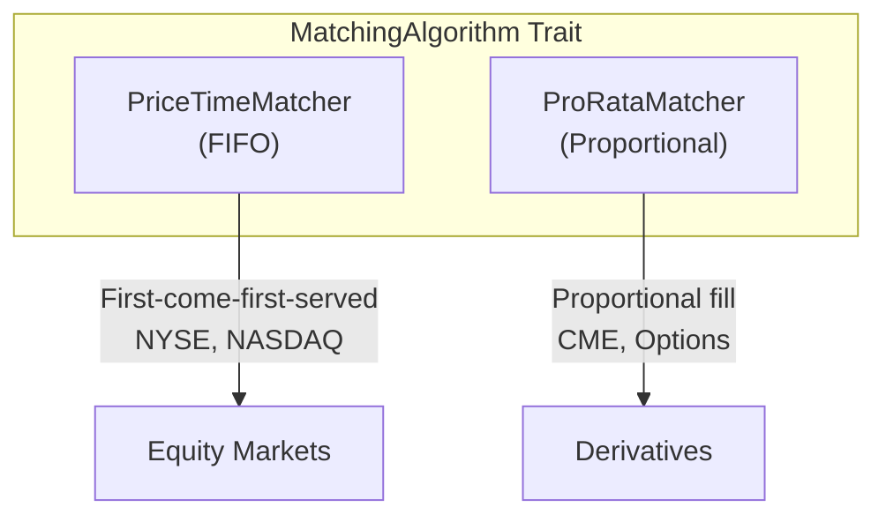

**Price-Time Priority (FIFO)**:
- Orders at a price level filled in arrival order
- Most common in equity exchanges

**Pro-Rata**:
- Orders filled proportionally based on size
- Formula: `fill_qty = (order_qty / total_qty) * available_qty`

---

## Application Layer

### Use Cases

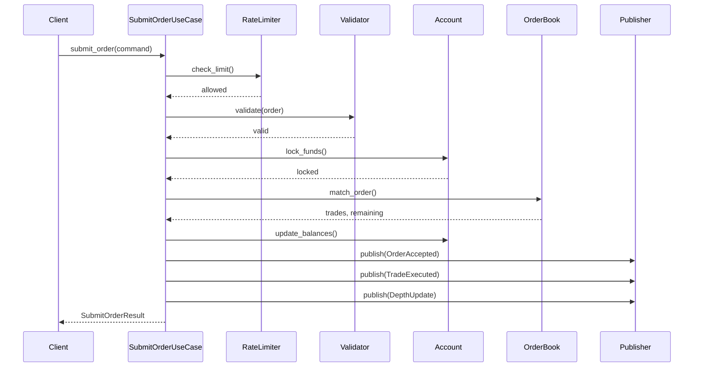

### Port Interfaces (Dependency Inversion)

```rust
// Domain defines the interface
pub trait OrderBookRepository: Send + Sync {
    async fn get(&self, symbol: &Symbol) -> Option<OrderBook>;
    async fn get_or_create(&self, symbol: &Symbol) -> OrderBook;
    async fn save(&self, book: OrderBook);
}

// Infrastructure implements it
pub struct InMemoryOrderBookRepository { /* ... */ }
impl OrderBookRepository for InMemoryOrderBookRepository { /* ... */ }
```

---

## Infrastructure Layer

### Event Publisher

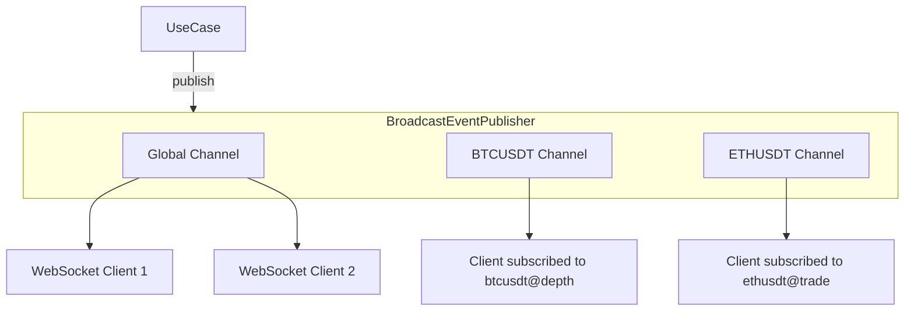

### Simulation Clock

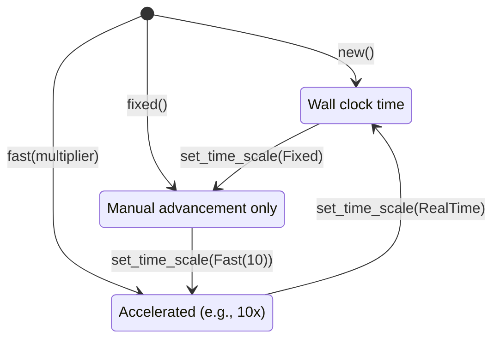

### Rate Limiter (Token Bucket)

| Limit Type | Default | Purpose |
|------------|---------|---------|
| `requests_per_minute` | 1200 | General HTTP requests |
| `orders_per_second` | 10 | Order submissions |
| `orders_per_day` | 200000 | Daily order limit |
| `ws_connections_per_ip` | 5 | WebSocket connections |

---

## Presentation Layer

### REST API (Binance Compatible)

| Endpoint | Method | Description |
|----------|--------|-------------|
| `/api/v3/ping` | GET | Connectivity check |
| `/api/v3/time` | GET | Server time |
| `/api/v3/exchangeInfo` | GET | Trading rules & symbols |
| `/api/v3/depth` | GET | Order book snapshot |
| `/api/v3/order` | POST | Place order |
| `/api/v3/order` | DELETE | Cancel order |

### WebSocket Streams

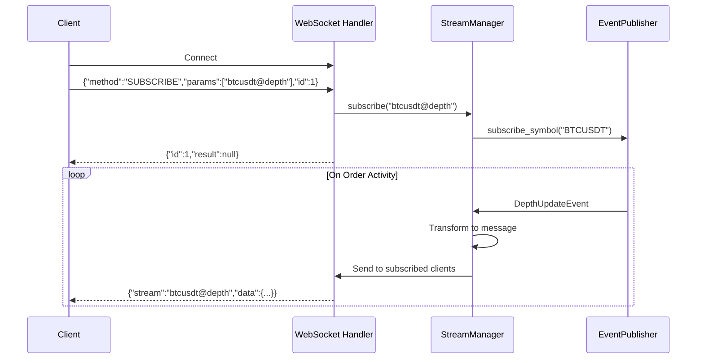

**Available Streams**:
- `{symbol}@depth` - Real-time depth updates
- `{symbol}@depth@100ms` - 100ms batched updates
- `{symbol}@trade` - Executed trades
- `{symbol}@aggTrade` - Aggregated trades

---

## Order Matching

### Match Order Flow

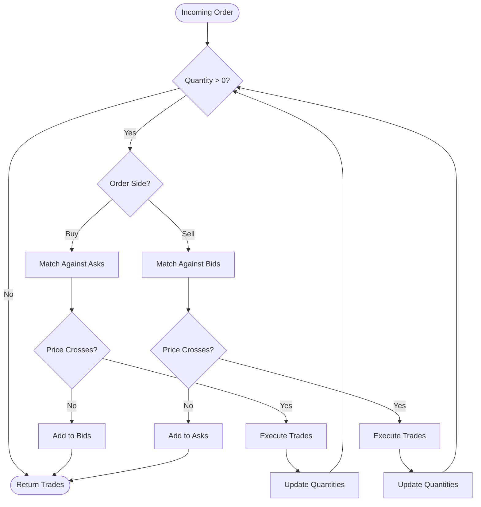

### Price-Time Example

```
Order Book (Asks):
  $100.00: [5 BTC (t=1), 10 BTC (t=2)]
  $100.10: [3 BTC (t=3)]

Incoming: Buy 8 BTC @ $100.00

Execution:
  1. Fill 5 BTC from first order (t=1) → Trade: 5 BTC @ $100
  2. Fill 3 BTC from second order (t=2) → Trade: 3 BTC @ $100
  3. Aggressor exhausted (0 BTC remaining)

Result: 2 trades, second resting order has 7 BTC left
```

---

## Key Flows

### Order Placement Flow

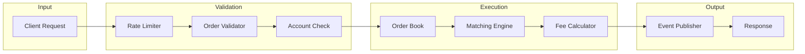

### WebSocket Streaming Flow

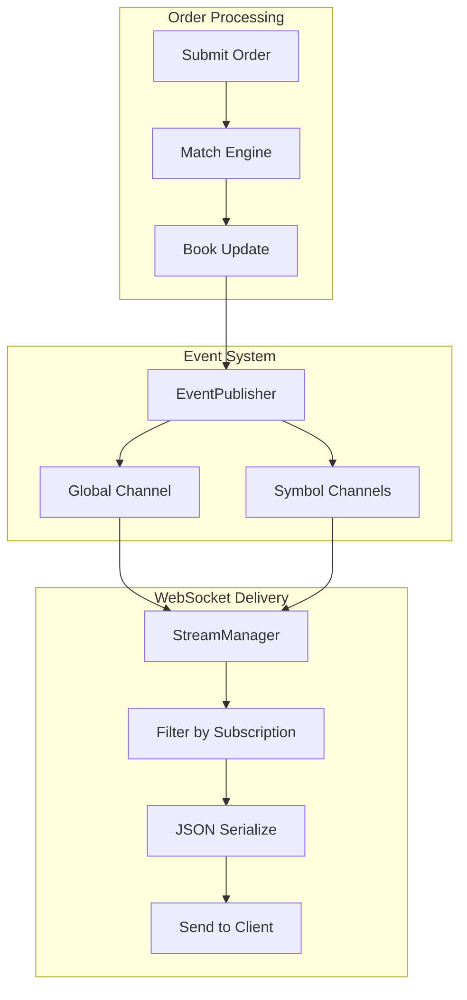

---

## API Reference

### Place Order

```bash
POST /api/v3/order
Content-Type: application/json
X-MBX-APIKEY: your-api-key

{
  "symbol": "BTCUSDT",
  "side": "BUY",
  "type": "LIMIT",
  "timeInForce": "GTC",
  "quantity": "1.0",
  "price": "45000.00"
}
```

### Get Order Book

```bash
GET /api/v3/depth?symbol=BTCUSDT&limit=20

Response:
{
  "lastUpdateId": 1234567,
  "bids": [
    ["45000.00", "1.5"],
    ["44999.00", "2.0"]
  ],
  "asks": [
    ["45001.00", "0.8"],
    ["45002.00", "1.2"]
  ]
}
```

### WebSocket Subscribe

```json
// Request
{"method": "SUBSCRIBE", "params": ["btcusdt@depth"], "id": 1}

// Response
{"id": 1, "result": null}

// Stream Data
{
  "stream": "btcusdt@depth",
  "data": {
    "U": 123,
    "u": 125,
    "b": [["45000.00", "1.5"]],
    "a": [["45001.00", "0.8"]]
  }
}
```

---

## Configuration

### JSON Configuration

```json
{
  "server": {
    "host": "0.0.0.0",
    "port": 8080,
    "event_capacity": 10000
  },
  "rate_limits": {
    "requests_per_minute": 1200,
    "orders_per_second": 10,
    "orders_per_day": 200000
  },
  "markets": [
    {
      "symbol": "BTCUSDT",
      "base_asset": "BTC",
      "quote_asset": "USDT",
      "price_precision": 2,
      "quantity_precision": 6,
      "min_notional": "10.0"
    }
  ],
  "accounts": [
    {
      "owner_id": "trader1",
      "deposits": [
        {"asset": "USDT", "amount": "100000.0"},
        {"asset": "BTC", "amount": "10.0"}
      ]
    }
  ]
}
```

### Programmatic Setup

```rust
use exchange_sim::Exchange;

#[tokio::main]
async fn main() {
    let exchange = Exchange::builder()
        .with_default_markets()
        .with_rate_limits(RateLimitConfig::default())
        .build();

    // Add custom market
    exchange.add_market(TradingPairConfig {
        symbol: "ETHUSDT".into(),
        base_asset: "ETH".into(),
        quote_asset: "USDT".into(),
        ..Default::default()
    }).await;

    // Start server
    exchange.serve("0.0.0.0:8080").await;
}
```

---

## Design Patterns

| Pattern | Usage |
|---------|-------|
| **Strategy** | `MatchingAlgorithm` with multiple implementations |
| **Repository** | Data access abstraction with in-memory implementations |
| **Observer** | `EventPublisher` broadcasts to subscribers |
| **Command** | Use cases encapsulate operations |
| **Dependency Injection** | All dependencies passed via constructors |
| **State Machine** | Order status transitions |

---

## Supported Instruments

- **Spot**: Immediate delivery trading
- **Futures**: Perpetual contracts with leverage
- **Options**: Calls/puts with expiration
- **Perpetual**: Funding rates and position management

---

## Testing

```bash
# Run all tests
cargo test

# Run with logging
RUST_LOG=debug cargo test

# Integration tests only
cargo test --test '*'
```

---

## License

See [LICENSE](../LICENSE) for details.
